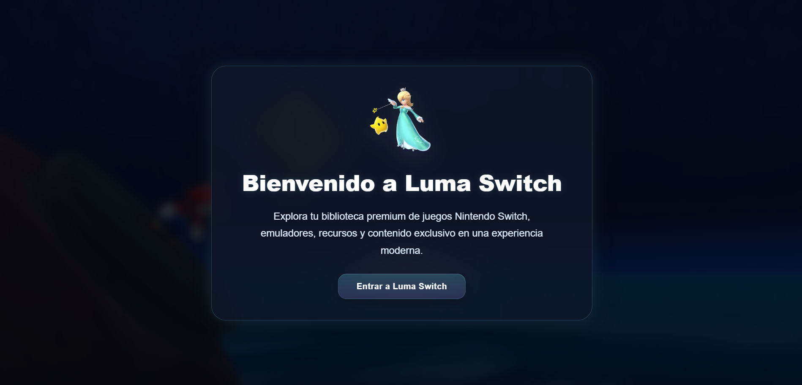
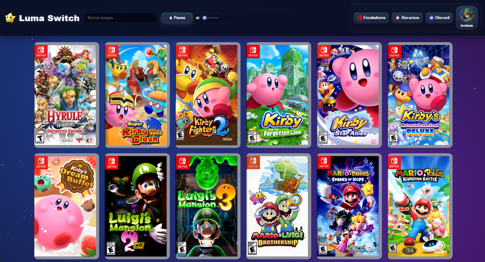
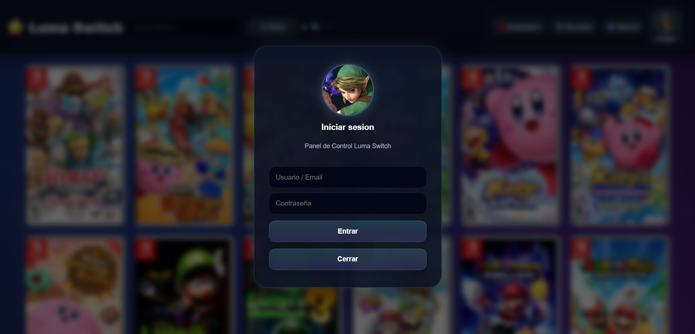

  

<h1 align="center">Luma Switch</h1>

  

Luma Switch es una biblioteca digital diseñada para que los usuarios encuentren y gestionen contenido para Nintendo Switch de forma rápida, sencilla y organizada, con una experiencia inspirada en el universo de Mario Galaxy.

## ✨ Características

* 🚀 Links directos de descarga sin publicidad invasiva.
* 🛡️ Archivos verificados y libres de malware.
* 🎮 Compatibilidad con consolas Nintendo Switch y emuladores.
* 💬 Comunidad activa en Discord para soporte y ayuda.
* 📚 Amplio catálogo de juegos en constante crecimiento.
* 🔍 Buscador integrado para encontrar contenido fácilmente.
* 🌌 Interfaz moderna inspirada en el espacio y Mario Galaxy.
* 📱 Diseño adaptable para dispositivos móviles y PC.

## 📸 Capturas

## 🚀 Tecnologías utilizadas

* HTML5
* CSS3
* JavaScript
* GitHub Pages

## 🌐 Sitio web

Disponible en GitHub Pages.

https://madelrandel-blip.github.io/Luma/

## 💬 Comunidad de Discord

Únete a nuestra comunidad para recibir soporte, enterarte de las novedades del proyecto y compartir experiencias con otros usuarios.

  

## 🎯 Objetivo del proyecto

El objetivo de Luma Switch es ofrecer una plataforma visualmente atractiva y fácil de usar para explorar un catálogo de contenido compatible con Nintendo Switch y emulación, acompañada de una comunidad donde los usuarios puedan recibir soporte y compartir experiencias.

## ⭐ Apoya el proyecto

Si te gusta Luma Switch, considera dejar una estrella al repositorio para apoyar su desarrollo.

---

Desarrollado con ❤️ para la comunidad de Nintendo Switch.

